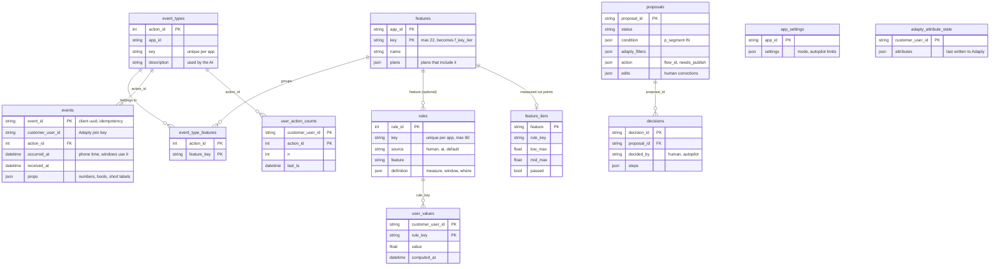

# Data model

Tables in `feature_signal/db/tables.py` (migration `0001`). Nested contract parts are JSON columns.

```mermaid
erDiagram
    features ||--o{ event_type_features : "groups"
    event_types ||--o{ event_type_features : "belongs to"
    event_types ||--o{ events : "action_id"
    event_types ||--o{ user_action_counts : "action_id"
    features ||--o{ rules : "feature (optional)"
    rules ||--o{ user_values : "rule_key"
    features ||--o| feature_tiers : "measured cut points"
    proposals ||--o{ decisions : "proposal_id"

    features {
        string app_id PK
        string key PK "max 22, becomes f_key_tier"
        string name
        json plans "plans that include it"
    }
    event_types {
        int action_id PK
        string app_id
        string key "unique per app"
        string description "used by the AI"
    }
    event_type_features {
        int action_id PK
        string feature_key PK
    }
    events {
        string event_id PK "client uuid, idempotency"
        string customer_user_id "Adapty join key"
        int action_id FK
        datetime occurred_at "phone time, windows use it"
        datetime received_at
        json props "numbers, bools, short labels"
    }
    user_action_counts {
        string customer_user_id PK
        int action_id PK
        int n
        datetime last_ts
    }
    rules {
        int rule_id PK
        string key "unique per app, max 80"
        string source "human, ai, default"
        string feature
        json definition "measure, window, where"
    }
    user_values {
        string customer_user_id PK
        string rule_key PK
        float value
        datetime computed_at
    }
    feature_tiers {
        string feature PK
        string rule_key
        float low_max
        float mid_max
        bool passed
    }
    proposals {
        string proposal_id PK
        string status
        json condition "p_segment IN"
        json adapty_filters
        json action "flow_id, needs_publish"
        json edits "human corrections"
    }
    decisions {
        string decision_id PK
        string proposal_id FK
        string decided_by "human, autopilot"
        json steps
    }
    app_settings {
        string app_id PK
        json settings "mode, autopilot limits"
    }
    adapty_attribute_state {
        string customer_user_id PK
        json attributes "last written to Adapty"
    }
```
