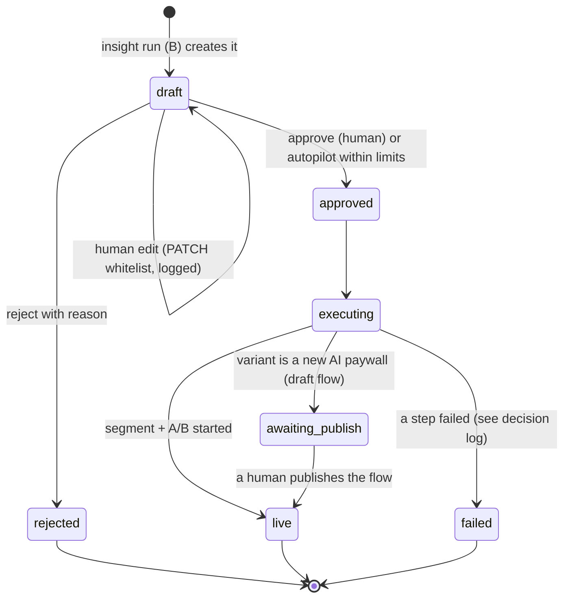
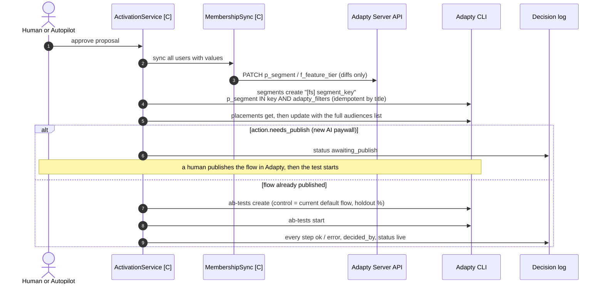

# Proposal lifecycle

Statuses from `docs/contracts/api.md` (Proposal). Publishing a flow is always human, also in autopilot.

```mermaid
stateDiagram-v2
    [*] --> draft: insight run (B) creates it
    draft --> draft: human edit (PATCH whitelist, logged)
    draft --> rejected: reject with reason
    draft --> approved: approve (human) or autopilot within limits
    approved --> executing
    executing --> live: segment + A/B started
    executing --> awaiting_publish: variant is a new AI paywall (draft flow)
    awaiting_publish --> live: a human publishes the flow
    executing --> failed: a step failed (see decision log)
    rejected --> [*]
    live --> [*]
    failed --> [*]
```

## What approve does in Adapty

```mermaid
sequenceDiagram
    autonumber
    actor Human as Human or Autopilot
    participant C as ActivationService [C]
    participant Sync as MembershipSync [C]
    participant API as Adapty Server API
    participant CLI as Adapty CLI
    participant Log as Decision log

    Human->>C: approve proposal
    C->>Sync: sync all users with values
    Sync->>API: PATCH p_segment / f_feature_tier (diffs only)
    C->>CLI: segments create "[fs] segment_key"<br/>p_segment IN key AND adapty_filters (idempotent by title)
    C->>CLI: placements get, then update with the full audiences list
    alt action.needs_publish (new AI paywall)
        C->>Log: status awaiting_publish
        Note over Human,CLI: a human publishes the flow in Adapty, then the test starts
    else flow already published
        C->>CLI: ab-tests create (control = current default flow, holdout %)
        C->>CLI: ab-tests start
        C->>Log: every step ok / error, decided_by, status live
    end
```
